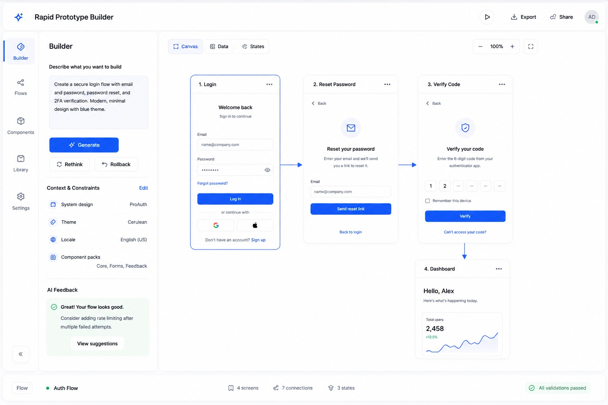

# PROPOSAL: Rapid Prototype Builder

## Executive summary

**Rapid Prototype Builder** transforms plain-language UI requirements into interactive prototypes with platform-compatible screens that product, QA, and engineering teams can explore and validate.

It replaces the slow, fragmented path from idea → mockup → implementation with a unified system that generates validated UI screens directly from prompts, resolves dependencies against approved component libraries, and enables teams to simulate complete user journeys before development begins.

By combining AI-driven generation, strict validation, and flow orchestration, the system accelerates ideation, reduces ambiguity, and surfaces design and logic issues early—when they are cheapest to fix.

---

## The problem we solve

Despite advances in AI, prototyping modern applications remains challenging because UI and behavior are still designed separately within fragmented, linear workflows:

- Requirements are written in natural language
- Designers translate them into static mockups
- Engineers reinterpret requirements and mockups into code
- Teams iterate through multiple clarification cycles

This separation introduces systemic friction:

- High cognitive load and constant context switching
- Rework caused by ambiguous or misinterpreted requirements
- Delayed feedback during early design phases
- PRDs that fail to capture component-level behavior and interactions
- Inconsistent UI patterns across similar features
- Duplication of mockups with minor variations
- Static designs that lack interaction fidelity
- Hidden complexity in flows, states, and edge cases

As a result, teams spend significant time reconciling gaps and aligning interpretations before meaningful implementation can begin, slowing delivery and increasing the risk of downstream errors.

---

## Core idea

Instead of separating design, logic, and implementation, *builders* describe what the interface should do and how it should behave, while the system generates structured, interactive prototypes aligned with the target platform.

Builders provide high-level constraints and context that guide screen generation, including:

- system design
- theme
- locale
- enabled component packs

They can then describe how those screens connect into flows:

- navigation sequence (e.g. auth, dashboard, forms)
- transition conditions and branching logic
- shared data carried across screens
- component-level interactions that trigger flow changes

**The AI workflow:**

1. Builds an initial version based on a mockup using VLM models.
2. Use a dedicated fast-editing model (like Cerebras models) to generate screen
3. Validates syntax and security policy in the backend.
4. Detect ui components required.
5. Resolves dependencies from a central component registry.
6. Compiles and sanitizes output to produce an immediate preview.
7. Links screens inside a visual flow canvas with transition, branch, and state mapping.
8. AI model analyze screen to bring usability feedback.
9. User can iterate on the prompt and feedback to refine the output (back step 2)

This establishes a closed-loop system where generation, validation, and refinement run continuously, combining an automated harness with a human in the loop to enable rapid exploration and convergence on secure, consistent UI solutions.

---

## Required AI Models:

- **Image-to-code:** `gpt-image-1` from **OpenAI** for converting reference images into UI code candidates. (High quatily ~$0.17/image)
- **Image generation:** `imagen-4.0-generate-001` from **OpenAI** for visual concept or inspiration. ($0.06 per image)
- **AI engine:** `gpt-oss-120b` from **Cerebras** for screen fast-editing. ($0.75 / 1M tokens)

**Cerebras** specializes in large language models optimized for high-performance hardware, enabling low-latency, iterative generation workflows.

**OpenAI**'s models complement this by providing strong multimodal capabilities, including image understanding and generation, enhancing input flexibility and output quality.